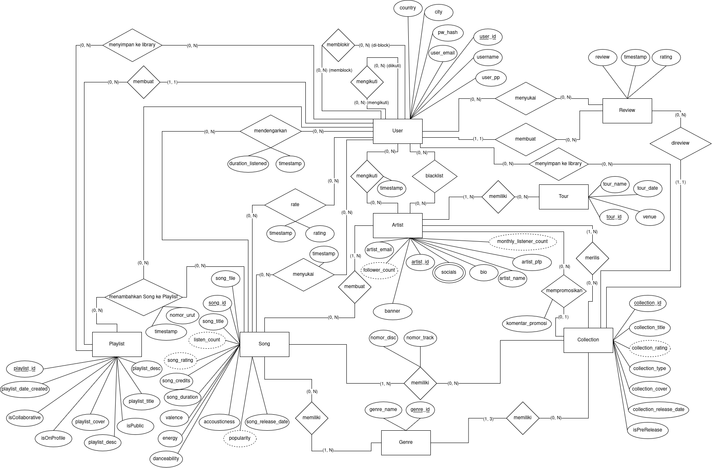
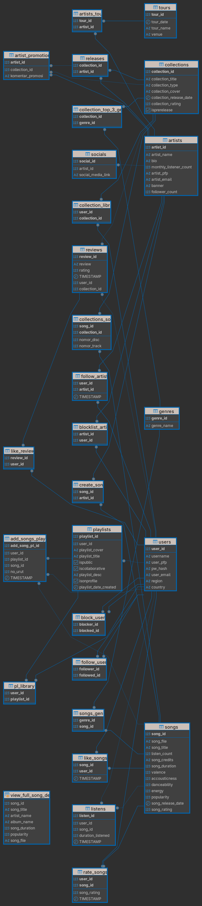

# Music Streaming Database Project

This project is a relational database system for a music streaming platform, developed for a college course. The schema models the essential features of modern music services, including users, artists, songs, playlists, collections (albums/EPs), genres, reviews, ratings, and social interactions.

## Schema Overview

- **Users**: Registration, profile, region, country, authentication.
- **Artists**: Profiles, social media, tours, promotions.
- **Songs**: Metadata, credits, audio features (valence, energy, etc.), ratings, genres.
- **Collections**: Albums, EPs, with release dates, ratings, and top genres.
- **Playlists**: User-created, collaborative, public/private, with covers and descriptions.
- **Interactions**: Likes, follows, blocks, reviews, ratings, listening history.
- **Relationships**: Artists to songs, users to playlists, songs to genres, etc.




## Current Progress

- **Data Models**: ✔️ Complete (see `/models`)
- **DDL (Schema Creation)**: ✔️ Complete (see `/database`)
- **DML (Data Manipulation Language)**: ✔️ Complete (data population, updates, deletes)
- **Views**: ✔️ Complete
- **Functions & Procedures**: ✔️ Complete
- **Triggers**: ✔️ Complete
- **Cronjobs**: ✔️ Complete

## Data Insertion 💾

1. Create .env profile
2. Insert your CLIENT_ID and CLIENT_SECRET from Spotify API
   ```bash
   SPOTIFY_CLIENT_ID=[YOUR CLIENT ID]
   SPOTIFY_CLIENT_SECRET=[YOUR CLIENT SECRET]
   ```
3. Don't forget to add .env to .gitignore
4. Run dummy/faker_spotify.py

## Getting Started

1. Review the data models for an overview of entities and relationships.
2. Use the DDL script to create the database schema in PostgreSQL 9.x.
3. All features are implemented and ready for use.

## License

For educational use only.
